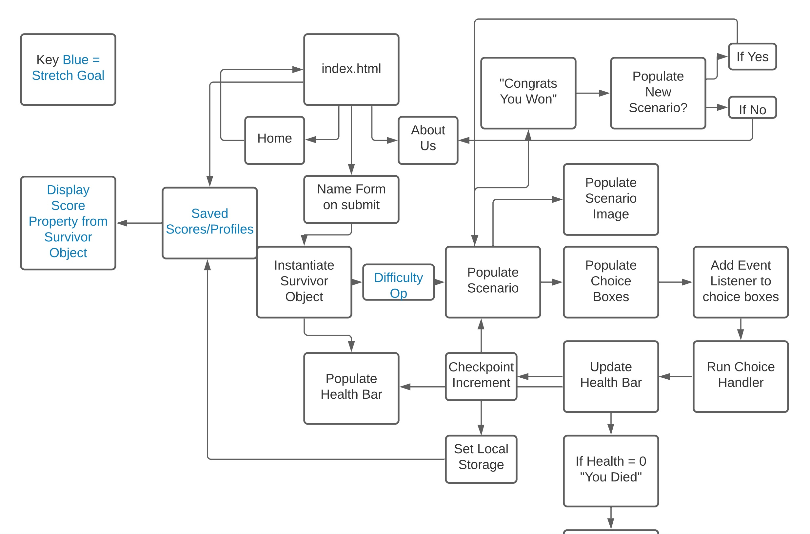

Vision
Minimum Length: 3-5 sentences

What is the vision of this product?

Our project revolves around the user clicking through a series of prompts, that will give or take away points depending on the chooices made. The object will be to make it through the different story lines without losing all of your points. Once completed a score will be saved and displayed. 

What pain point does this project solve?

The projects main purpose is entertainment and aleviation of boredom. 

Why should we care about your product?

If the user wants an fun and stimulating experience, while also immersing themselves in an engaging story.

Scope (In/Out)
IN - What will your product do
Describe the individual features that your product will do.
High overview of each. Only need to list 4-5

Minimum Viable Product vs
What will your MVP functionality be?

Minimal viable product is a page that loads and functions smoothly, while also establishing and storing the users content in order to track and display scores and achievements.

What are your stretch goals?

Current stretch goals are 
- Unlockable third story branch
- Collectable Achievments
- Stored Scores

Functional Requirements
List the functionality of your product. This will consist of tasks such as the following:

Instantiate survivor object upon page load

Populate Health bar

Store/display score

store- achievments

Data Flow
Describe the flow of data in your application. Write out what happens from the time the user begins using the app to the time the user is done with the app. Think about the “Happy Path” of the application. Describe through visuals and text what requests are made, and what data is processed, in addition to any other details about how the user moves through the site.

